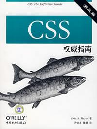

# CSS

下载[项目文件](https://github.com/onface/mooc.git)到本地，便于本地修改文件完成每一章的测试

比如 class 的测试 `/css/selector/test/class.html`

## 教材

| [CSS权威指南](https://github.com/onface/mooc/issues/1) |
| :------------- |
|  |

> 请按照我们指定的课程顺序学习，而不是按照书籍的章节顺序学习

> 浏览器请一律使用 Chrome 最新版本

## 课程

1. [使用CSS](./use-css/README.md)
2. [选择符与结构](./selector/README.md)
